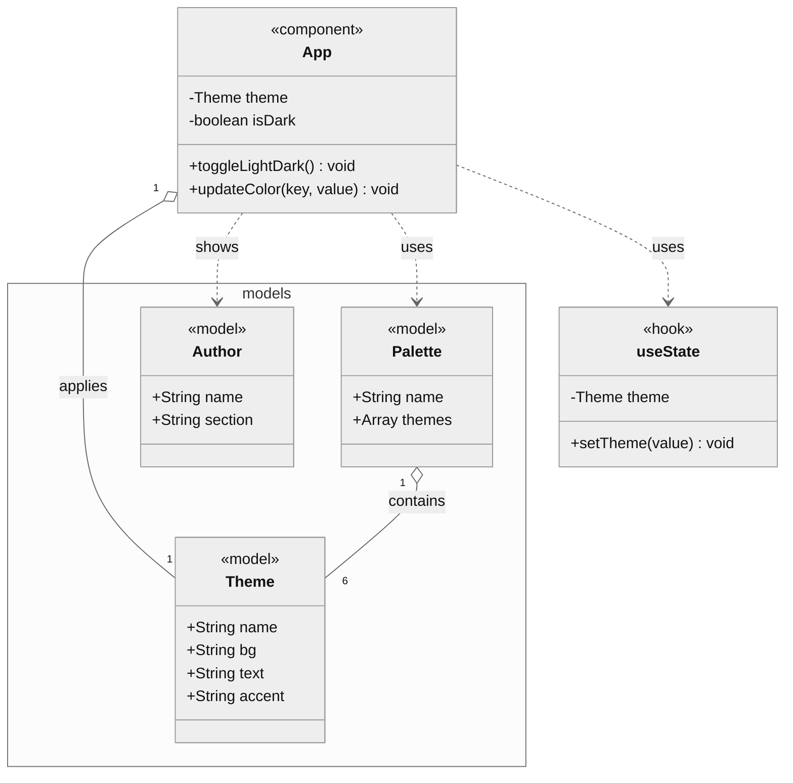

# Class Diagram

```mermaid
%%{init: {'theme':'neutral'}}%%
classDiagram
  class App {
    <<component>>
    -Theme theme
    -boolean isDark
    +toggleLightDark() void
    +updateColor(key, value) void
  }
  class useState {
    <<hook>>
    -Theme theme
    +setTheme(value) void
  }
  namespace models {
    class Palette {
      <<model>>
      +String name
      +Array themes
    }
    class Theme {
      <<model>>
      +String name
      +String bg
      +String text
      +String accent
    }
    class Author {
      <<model>>
      +String name
      +String section
    }
  }

  App ..> useState : uses
  App ..> Palette : uses
  App ..> Author : shows
  App "1" o-- "1" Theme : applies
  Palette "1" o-- "6" Theme : contains
```
